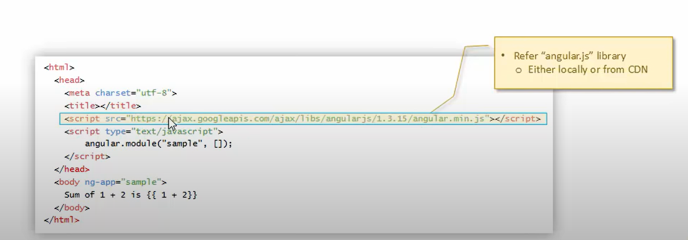
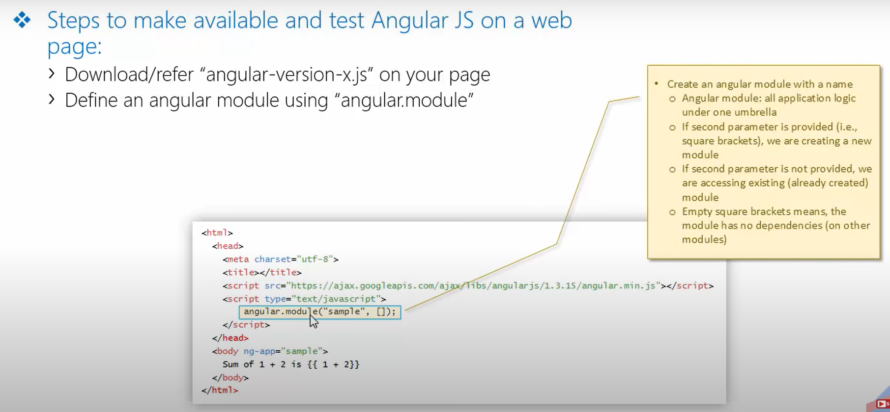
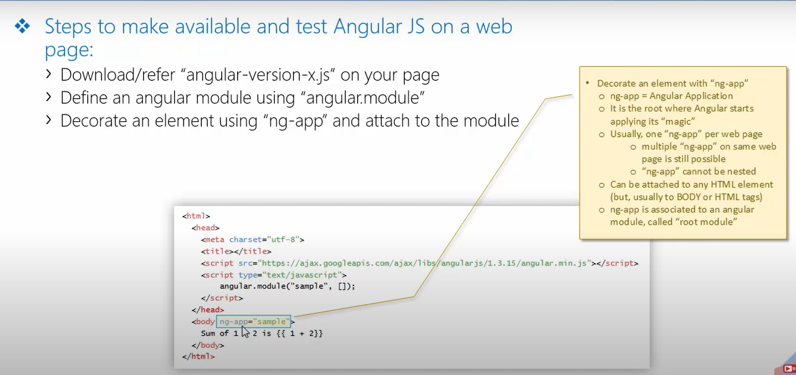
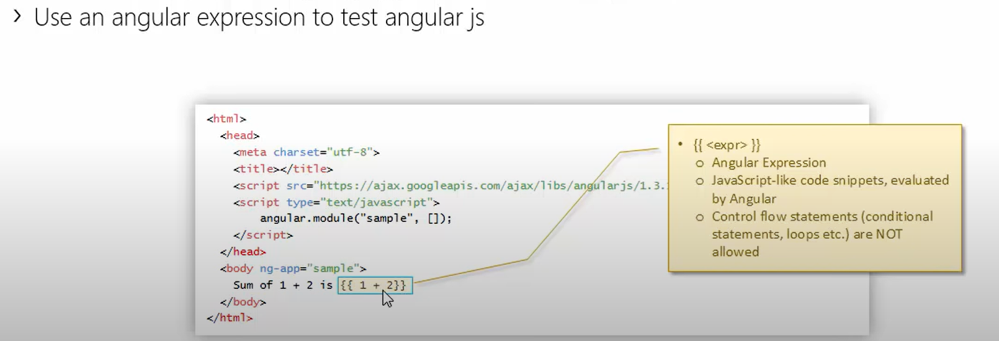

## What is Angular JS
1. A Client Side JS ramework
2. Developed and being maintained by Google
3. Goals
    - Separate DOM manipulation from application logic.
    - Separation of concerns (using MVC like pattern)
    - Make SPA (*single page application*) development easier
    - Provide solid foundation for robust/enterprise-scale JS client-side applications
    - Extensibility & Customization

## Make AngularJS available to Web page

- Download/refer "angular-version-x.js" on your page.

- Define an angular module using "angular.module"

- Decorate an element using "ng-app" and attach to the module

- Use an angular expression to test angular js
