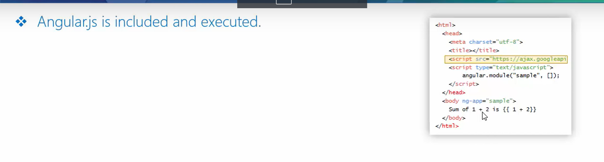
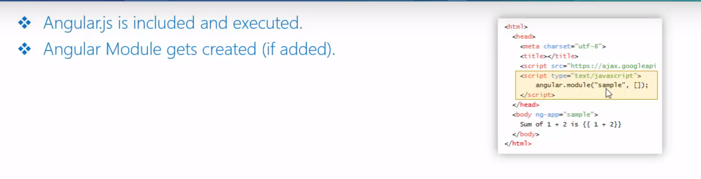
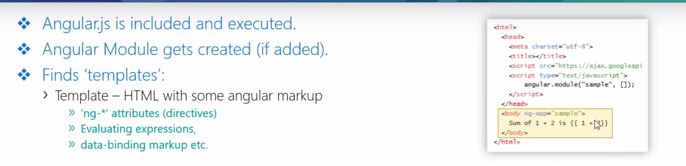
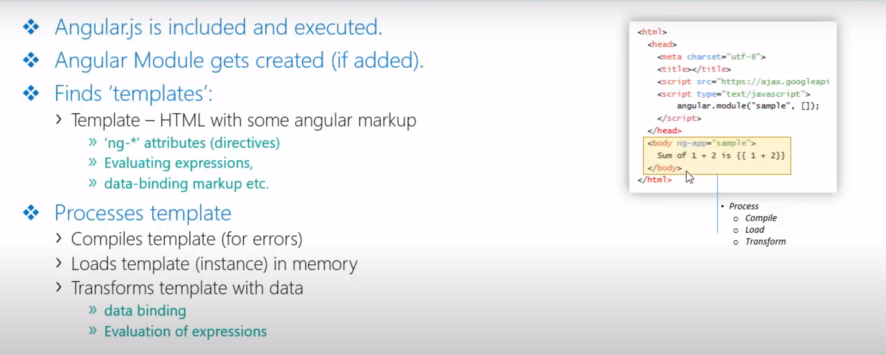
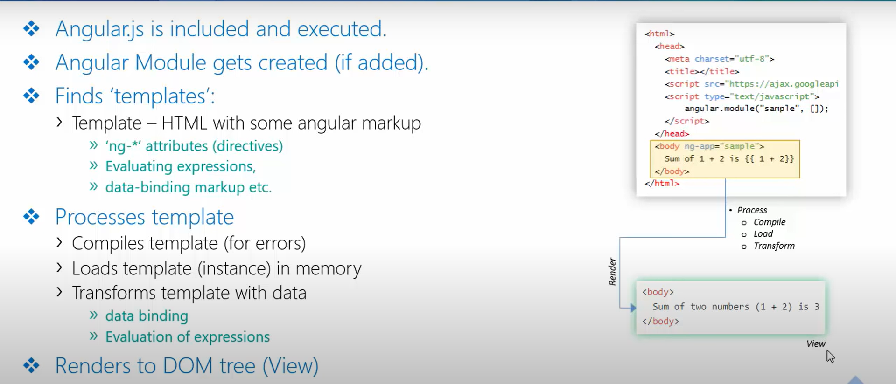
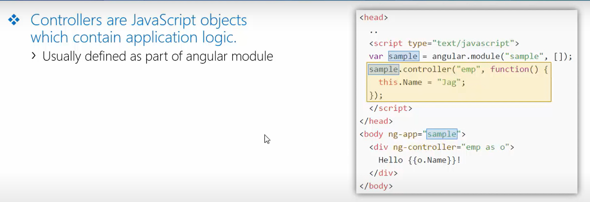
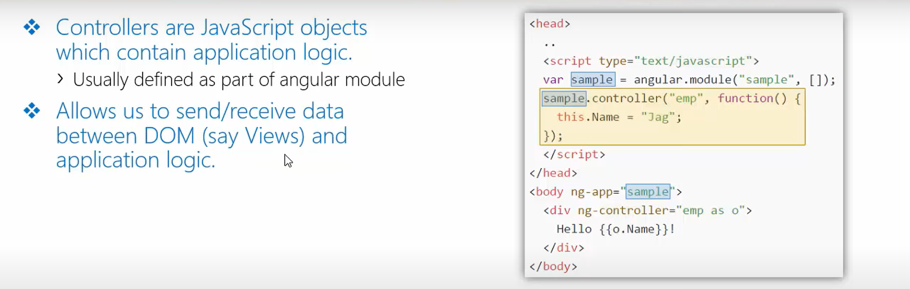
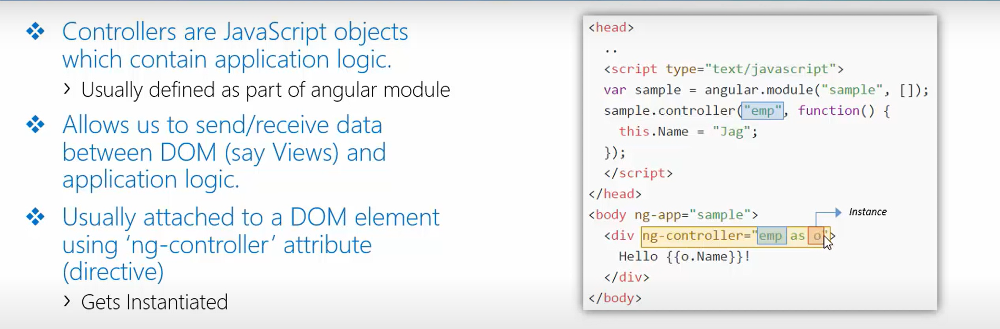
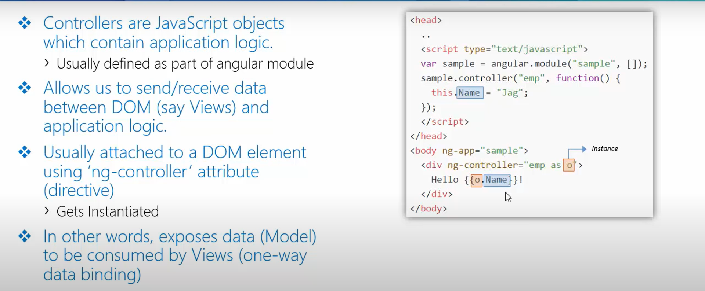
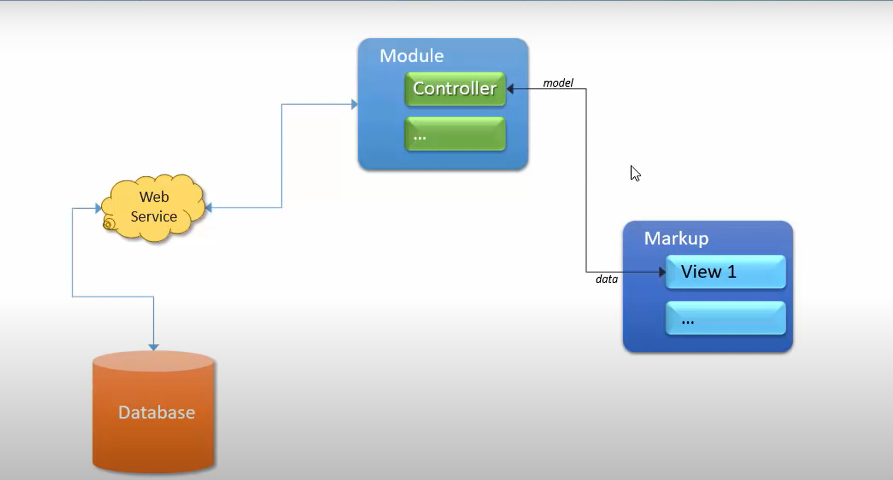

## High-level Overview - Angular Process

- AngularJS is included and executed.

- Angular module gets created (if added).

- Find 'Templates'
    - *Template* -> HTML with some angular markup
        - 'ng-*' attributes (directives)
        - Evaluating expressions,
        - data-binding markup etc.

- Processes template
    - Compiles template (for errors)
    - Loads template (instance) in memory
    - Transforms template with data
        - data binding
        - Evaluation of expressions

- Renders to DOM Tree (View)

## Angular JS - Controllers

- *Controllers* are JavaScript objects which contain application logic.
    - Usually defined as part of angular module.
    

- Allows us to send/receive data between DOM (say Views) and application logic.
    

- Usually attached to a DOM element using 'ng-controller' attribute (directive)
    

- In other words, exposes data (Model) to be consumed by Views (one-way data binding) [*MVC pattern*]
    - Also sends takes data from Views (two-way data-binding)
    

## Controllers - Conceptual Diagram
