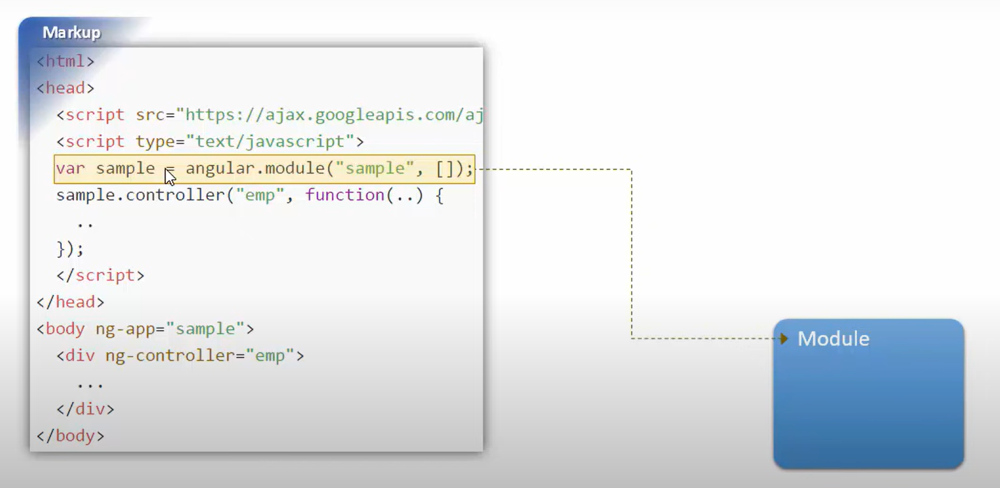
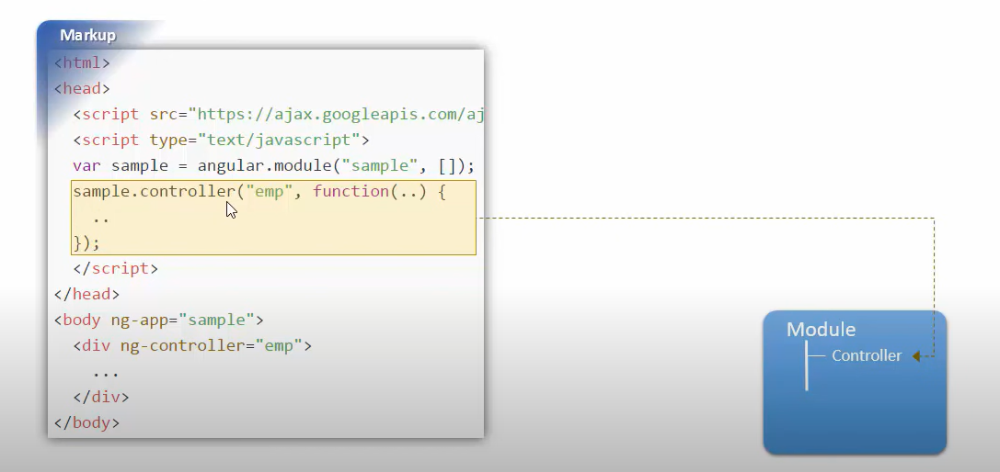
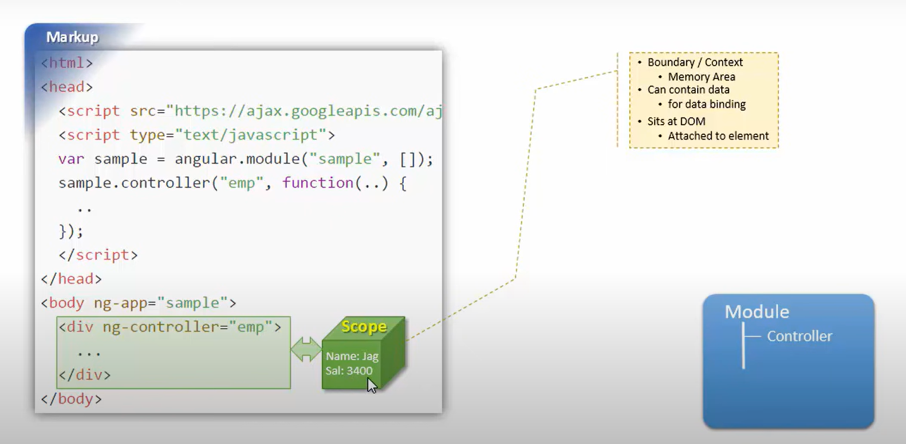
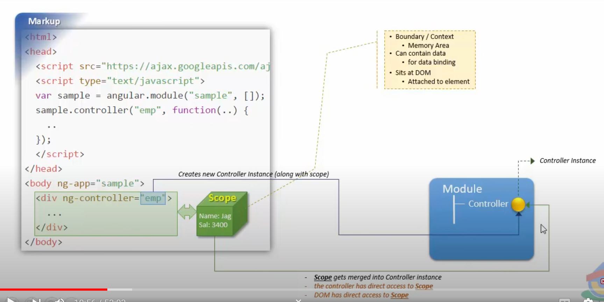
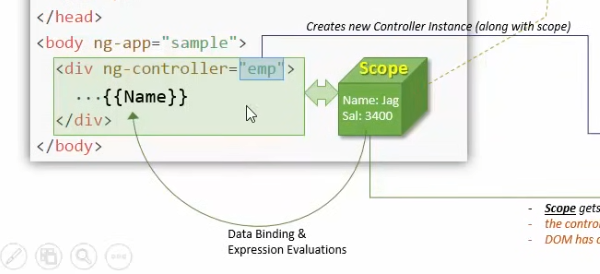
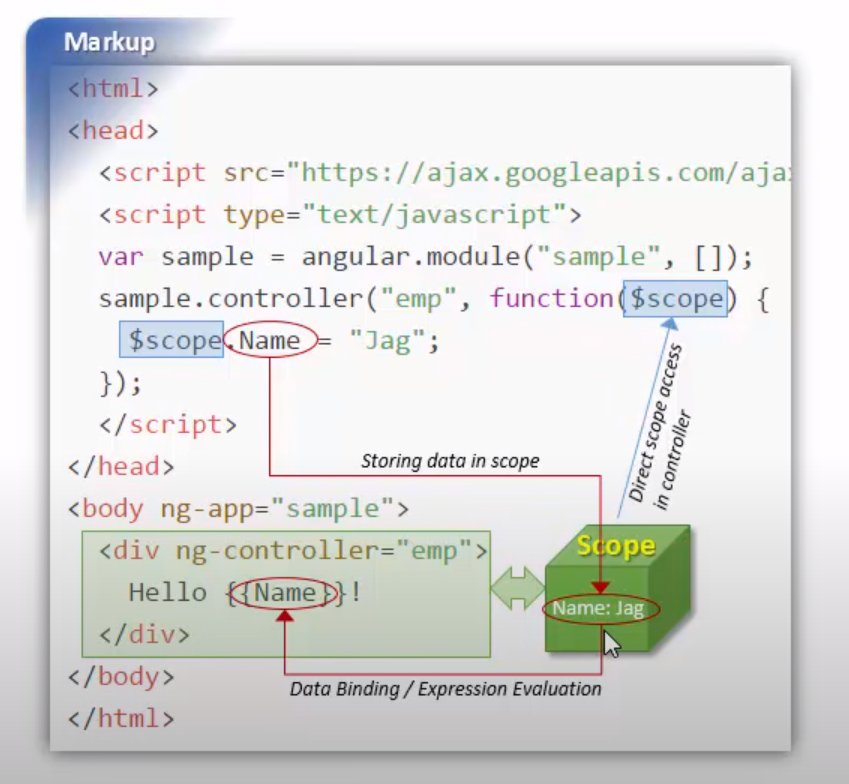
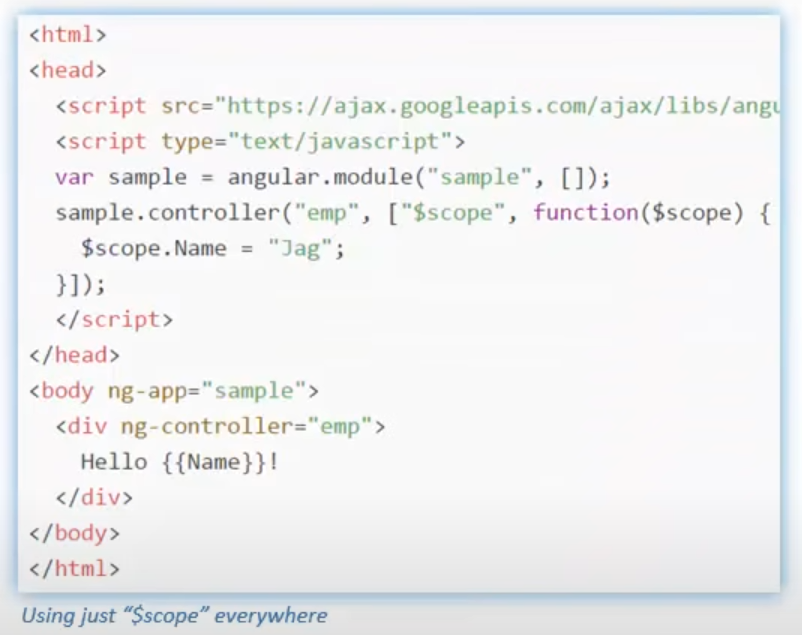
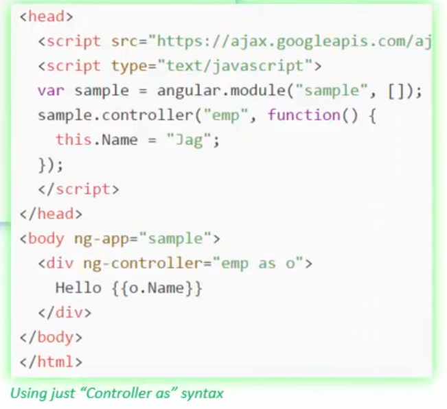
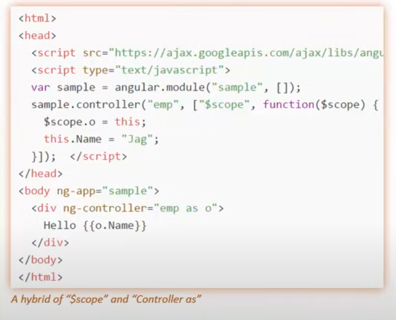

## Angular "Scope" 
1. 


2. 


3. 


4. 


5.


## Using Angular "scope" in controller




## How to Access a particular scope using Dev Tools

using  ```$0```  in console, we get the current element that is selected

to get the scope in angular we write   ```angular.element($0).scope()```

### Update values
```angular.element($0).scope.Name = "Sounak"```

to reflect the changes, we need to run digest method --> ```angular.element($0).scope.$digest()```


## Different Syntaxes

1. 


2.


3.
