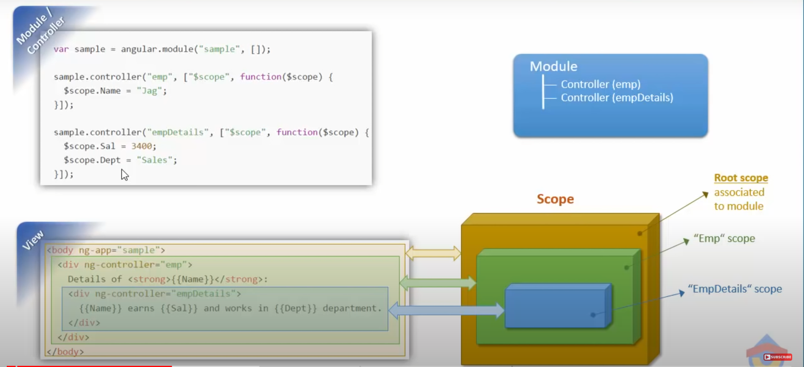
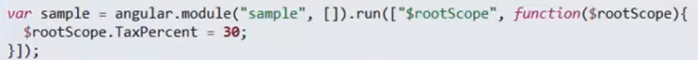
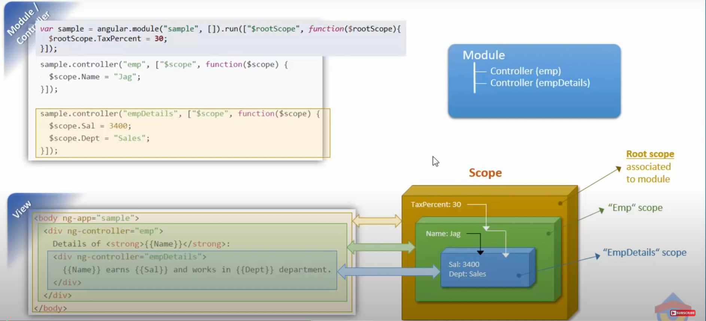
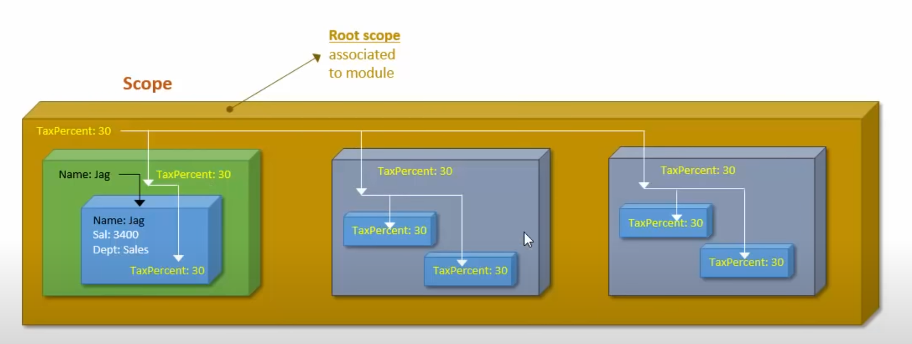
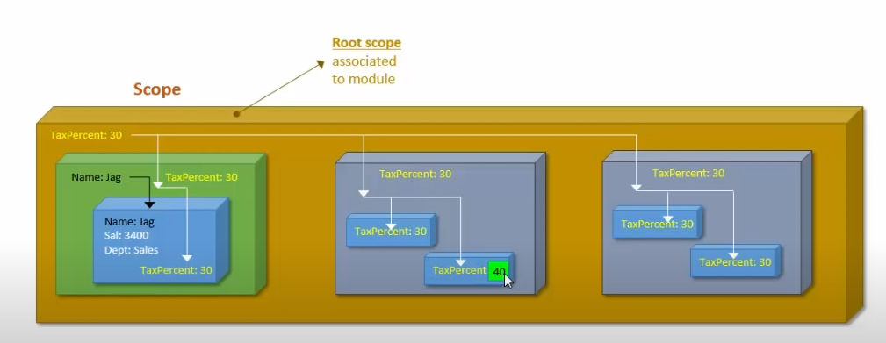
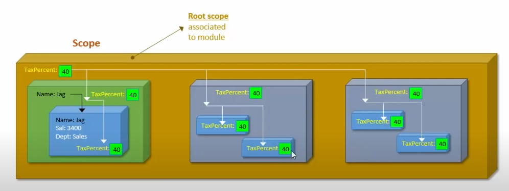
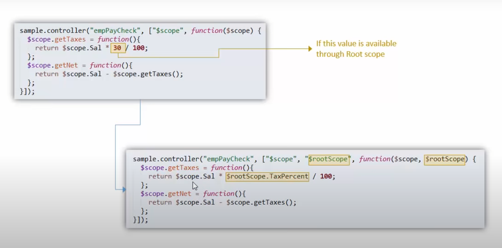

## RootScope ($rootScope)



Instead of ```var sample = angular.module("sample", [])```, we can use this -->




## Modifying Root Scope


once we try to modify one value


it'll modify the rootscope value everywhere


## Acessing Root Scope in Controller

